The NVIDIA MONAI Cloud APIs offer a comprehensive suite of tools designed to enhance workflows in medical imaging through interactive annotation, training, and inference. Here's an overview of their key features and how to get started:

## Key Features


1. **Interactive AI Annotation**: 
   - Utilizes the VISTA-3D foundation model.
   - Supports interactive AI annotation, enabling ongoing improvement of AI models through user feedback and new data integration.

2. **Auto3DSeg**:
   - Focuses on automating the process of 3D segmentation model creation.
   - Implements best practices to deliver state-of-the-art segmentation performance

3. **VISTA-3D Model**:
   - A robust foundation model, trained on 117 classes encompassing various organs and tumors.
   - The model's training and validation involved CT images from over 4,000 patients, ensuring its high accuracy and reliability for medical image analysis.

4. Dicon-web Setup and Dataset Configuration:
   - [Dicom-web Overview](#dicomweb-overview)
   - [Notebook: Dataset Creation and Experiment Selection](https://github.com/NVIDIA/monai-cloud-api/blob/main/notebooks/Dataset%20Creation%20and%20Experiment%20Selection.ipynb)

5. OHIF Plugin and Overview:
   - [Getting Started with OHIF Plugin](#getting-started-with-ohif-plugin)
   - [Setup Customized OHIF ](https://github.com/NVIDIA/monai-cloud-api/tree/main/plugins/ohif)
   - [OHIF Applications and UI Demo](#basic-ohif-instruction)
   - [Interactive Annotation](#interactive-annotation)
   - [Notebook: Annotation and OHIF Overview](https://github.com/NVIDIA/monai-cloud-api/blob/main/notebooks/Annotation%20and%20Continuous%20Learning%20Overview.ipynb)


## How to Get Started

To begin using the NVIDIA MONAI Cloud APIs, you can sign up for early access by filling out this survey: [NVIDIA MONAI Cloud API Early Access](https://developer.nvidia.com/nvidia-monai-cloud-api-early-access-program/join). 

## Getting Started with OHIF Plugin

MONAI Service provide ready-to-use playgroundw with API server and applications for users. 
If you are going to build and custimize OHIF viewer and MONAI Service plugin. Please refer to the [setup page](https://github.com/NVIDIA/monai-cloud-api/tree/main/plugins/ohif)

### Dicomweb Overview
Dataset storage can be variant, in the open-sourced setup. We recommend Orthanc for hosting dicom format medical images. 

### **Data Sources**

To create dataset, then you ready to create a reference object to that dataset by utilizing DICOMWeb. 
DICOMWeb is a modern web standard for accessing DICOM data. 
By connecting NVIDIA MONAI Cloud APIs to a DICOMWeb endpoint, 
you can seamlessly integrate to your data into many modern viewers.

In MONAI Service playground, it will automatically deploy Orthanc dicom-web server. 
For customized setup for Orthanc, 

**Steps:**

```bash
# Install Orthanc and DICOMweb plugin
sudo apt-get install orthanc orthanc-dicomweb -y

# Install Plastimatch
sudo apt-get install plastimatch -y
```

Upgrade to the latest version by following the steps mentioned on the [Orthanc Installation Guide](https://book.orthanc-server.com/users/debian-packages.html#replacing-the-package-from-the-service-by-the-lsb-binaries)

```bash
sudo service orthanc stop
sudo wget https://lsb.orthanc-server.com/orthanc/1.9.7/Orthanc --output-document /usr/sbin/Orthanc
sudo rm -f /usr/share/orthanc/plugins/*.so

sudo wget https://lsb.orthanc-server.com/orthanc/1.9.7/libServeFolders.so --output-document /usr/share/orthanc/plugins/libServeFolders.so
sudo wget https://lsb.orthanc-server.com/orthanc/1.9.7/libModalityWorklists.so --output-document /usr/share/orthanc/plugins/libModalityWorklists.so
sudo wget https://lsb.orthanc-server.com/plugin-dicom-web/1.6/libOrthancDicomWeb.so --output-document /usr/share/orthanc/plugins/libOrthancDicomWeb.so

sudo service orthanc restart
```

```
dicom_web_endpoint = ...
dicom_client_id = ...
dicom_client_secret = ...
```

After setup, you can use the Orthanc browser located at http://127.0.0.1:8042/app/explorer.html#upload to upload files.
if the dicomweb needs a credentials setup, please refer to [Orthanc Guide](https://orthanc.uclouvain.be/book/users/configuration.html)
Open the configuration.json and change credentials: 
```
// Whether or not the password protection is enabled
"AuthenticationEnabled" : true,

// The list of the registered users. Because Orthanc uses HTTP
// Basic Authentication, the passwords are stored as plain text.
"RegisteredUsers" : {
  "user": "pass"
}
```

### Basic OHIF Instruction


#### 1. **Study List**
Open OHIF viewer, the index page is a study list. The subjects listed are prepared in dicom-web storage. 

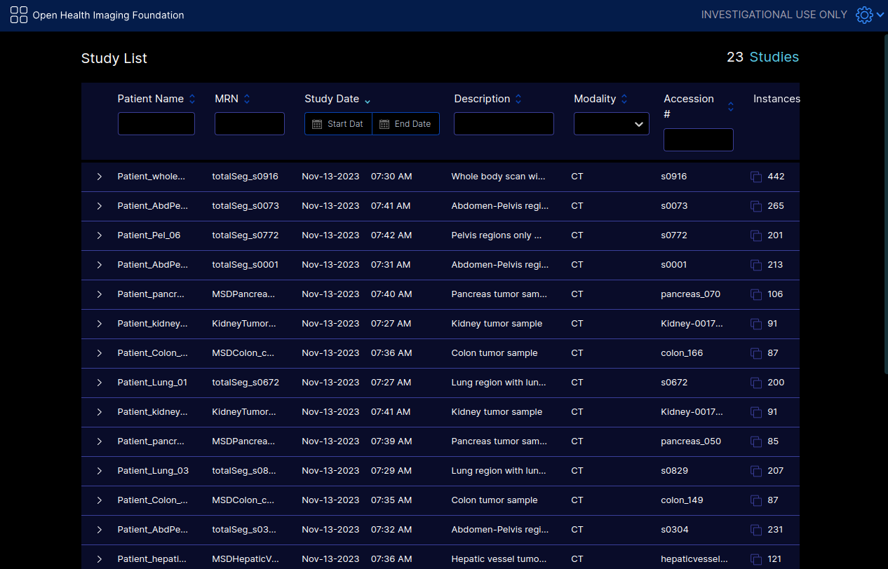

#### 2. **Select Subject** 

Click any subject you would like to annotate. 
The dropdwon panel will show several options. Select the `MONAI Service` 
to load the NVIDIA MONAI Cloud API plugin.

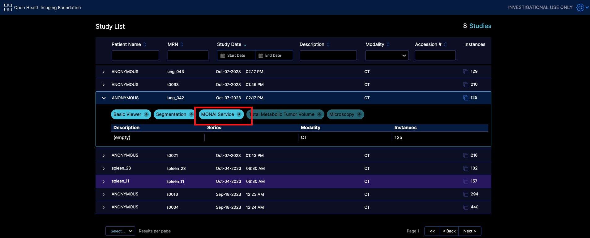

If you're using the API directly, you can use the `nextimage` endpoint.

#### 3. **Selected MONAI Service Plugin**

Click the MONAI Service plugin button on the right panel after the tri-planer views are up. 
The MONAI Service planel will show on the right, the plugin will automatically connect
to the running MONAI Service server and to load executed models and created datasets. 
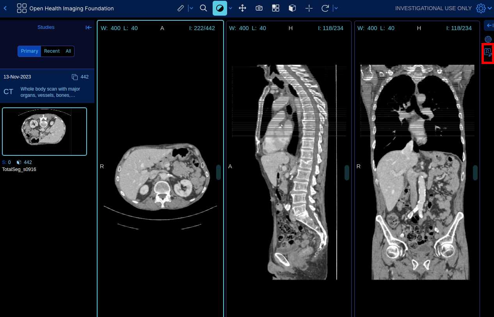


#### 4. **Run Inferencing Using Selected Method**

Below is a VISTA model application example demo:
VISTA model support multiple AI inference strategies.  
1. **Segment All Classes**: Predict all trained anatomy targets in the VISTA model. 
2. **Using Class Prompts**: Select and predict one or multiple anatomies with VISTA model.
3. **Using Point Prompts**: Place control point and edit the anatomy with click prompts. 

Once you've picked your preferred method, run the inference to get an initial annotation.

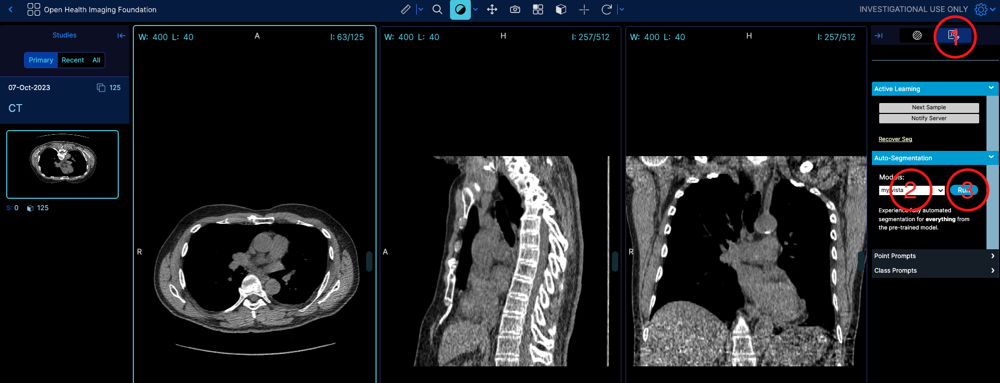

#### 5. **Annotate / Refine Annotations use side panel **

With the initial mask in place, you might notice areas that require manual tweaking. 
Use the provided annotation tools to:

- Refine boundaries
- Add or remove regions

This step ensures that your annotations are as accurate as possible.

**Steps**
1. Click the Segmentation button.
2. Select a class of segmentation that needs to be updated.
3. Select a segmentation tool.
4. Update the segmentation with this tool.

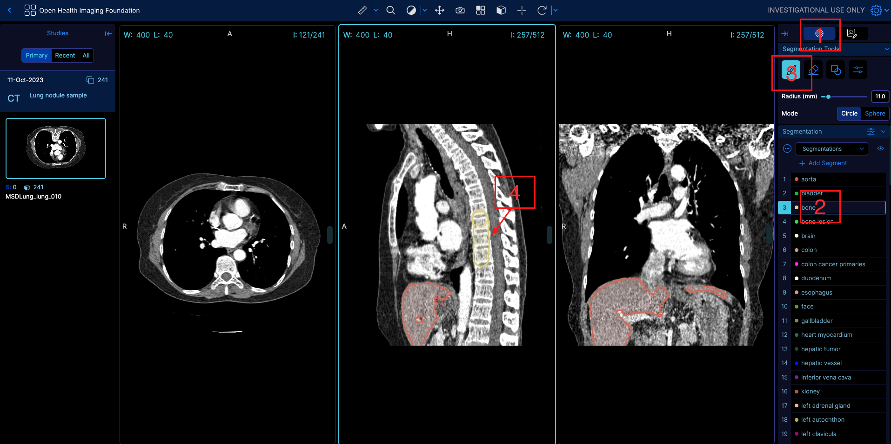

#### 6. **Save and Notify the Server**

Once you're satisfied with your annotations, the first step is to save the annotated image, ensuring that your work is captured. This will write back the image using the DICOMWeb protocal back to your datastore.

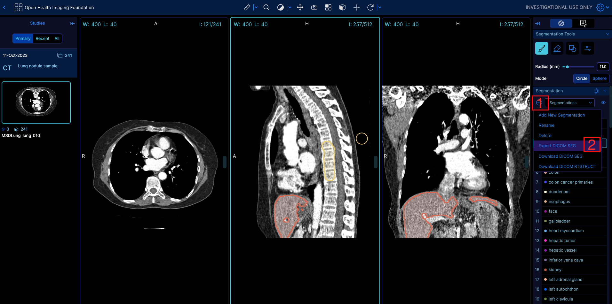

Next, notify the server that an image has been annotated. This step is crucial for continuous learning. The system will take note of the new annotations and after the indicated number of annotated images it will use them to improve the model over time.

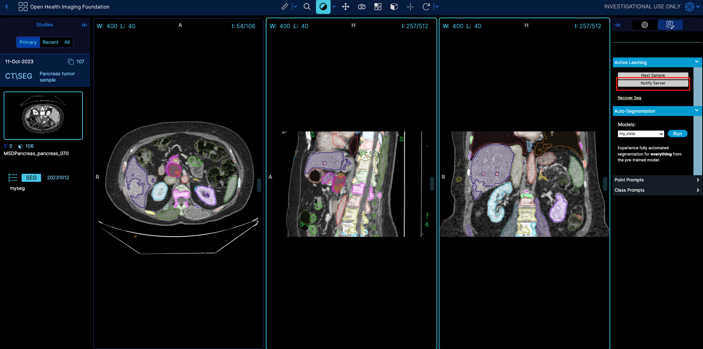

The associated API call run when you click the `Notify Server` button is below:

#### 7. **Next Image**
After finishing the current image, click next image button to load the next selected image using
active learning.
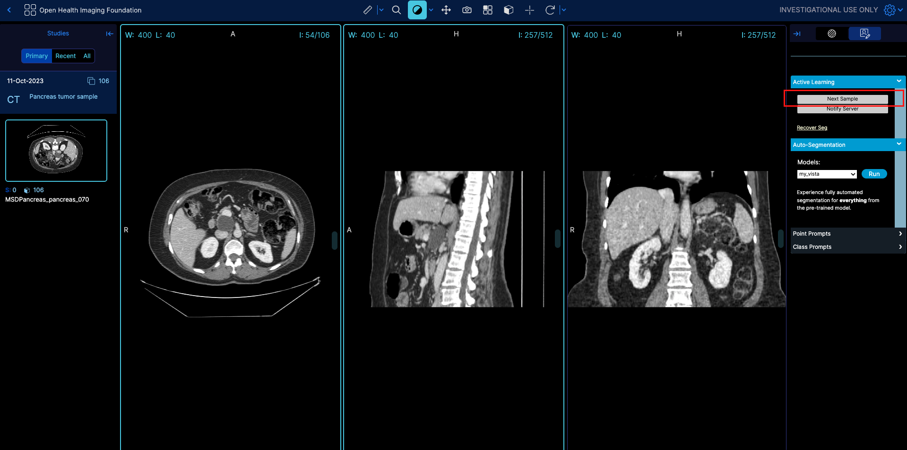


### Interactive Annotation
MONAI Service supports multiple applications such as VISTA and DeepEdit, VISTA model contains two interactive mode:
point prompt and class prompt. DeepEdit has only the point prompt interactive annotation. 

#### **Interactive Mode: Point Prompt**

Use mouse and click to place the control points within medical images. 
In OHIF MONAI Service plugin, user can use point prompts by clicking the
**Point Prompts**:
You can see availabel organs in the panel, select one anatomy for point
editing. After selecting, users can place points in any viewer planes. The point color is the same with the 
available organs. 

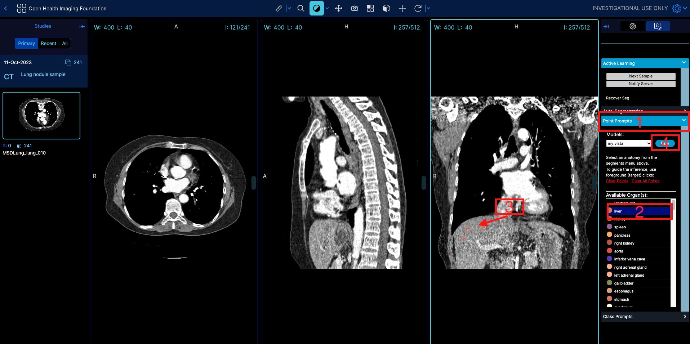

Click **Run** after the click the points for AI based inference.

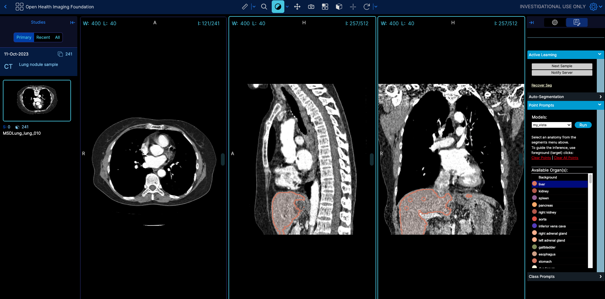

User can get the real-time prompt response for the point edits.

**Class Prompts**:

The class prompts is used when inference and annotating specific anatomies, VISTA model supprts more
 than 100 organs, bones, muscles, etc. Users can selecte one or multiple targets for AI inference. 

Select the anatomy by checking the checkbox table:

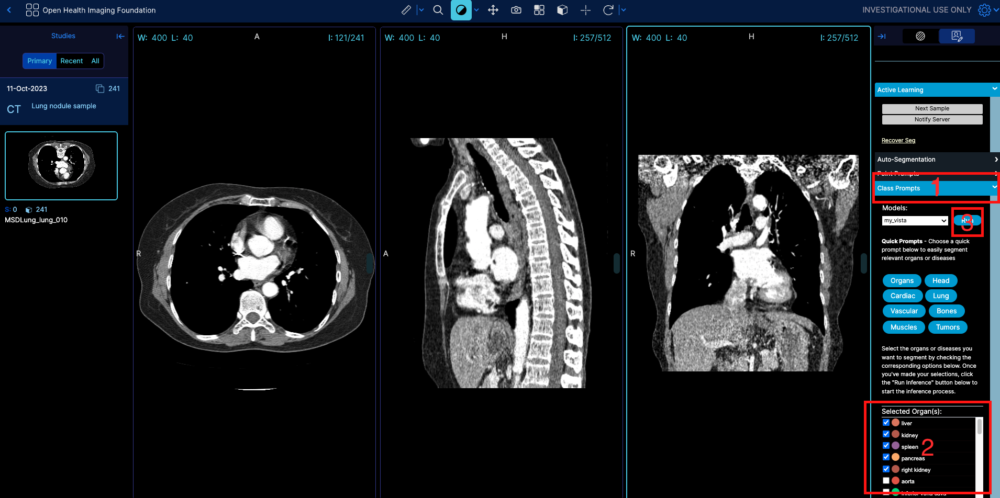

Click **Run** after the classes checkbox for AI based inference.

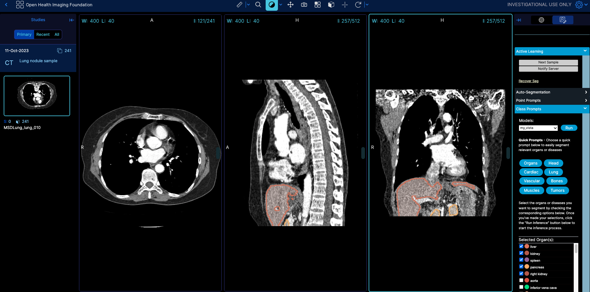

User can get the real-time prompt response for the class edits.